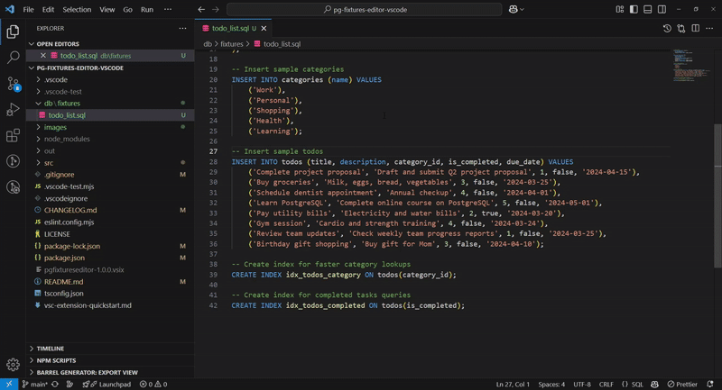

# PG Fixtures Editor

Utilities to edit SQL fixtures for Postgres databases.

Have you ever had to edit a SQL fixture after a DB schema migration? It's a real pain.
This extension aims to make this process easier.

## Features

Included commands:

- `Remove Column`: removes a column and its values from the selected INSERT statements.

## Known Issues

Please refer to the [pg-fixtures-editor docs](https://www.npmjs.com/package/pg-fixtures-editor) for known issues and quirks related to SQL parsing. It's the underlying library powering this extension.
